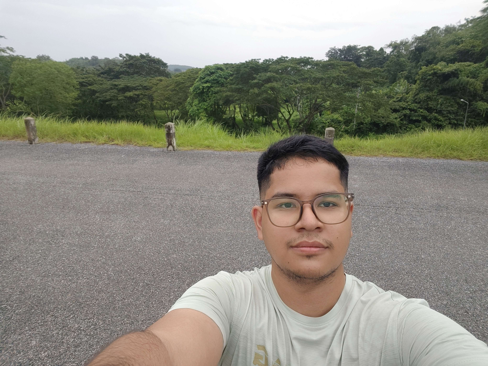

## Hi there 👋

  

I’m Hein Zaw, a software engineering student at Mae Fah Luang University, currently exploring the exciting world of software development and emerging technologies.

### About me
- 🔭 I’m currently learning and building my skills in software engineering.
- 🌱 My focus is on Agentic Development and understanding how intelligent systems can collaborate and solve real-world problems.
- 💡 I enjoy learning new concepts, experimenting with ideas, and turning them into practical solutions.
- 🤝 I’m a friendly person by nature, so talking with me feels like catching up with a long-time best friend.
- 🎯 I’m passionate about growing as a developer and creating meaningful work.

### Fun fact
I’m so friendly that you’ll probably feel like you’ve known me for years the moment we start talking.

### Connect with me
- GitHub: [@Justcode055](https://github.com/Justcode055)
- University: Mae Fah Luang University

> “The best way to grow is to keep learning, keep building, and keep being kind.”
